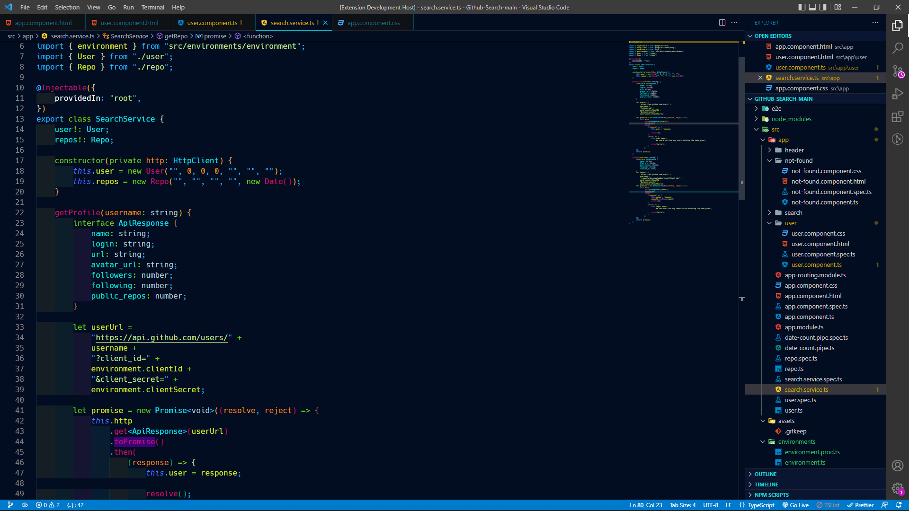

<!-- @format -->

<h1 align="center">
 Nairobi-Dark
</h1>

Ayu & 2077 inspired theme.

## Installation

1. Open **Extensions** sidebar panel in VS Code. `View → Extensions`
2. Search for `Nairobi-Dark theme` - find the one by **Amani**.
3. Click **Install** to install it.
4. Click **Reload** to reload your editor
5. Code > Preferences > Color Theme > **Nairobi-Dark**

<h2 align="center">
  Preview Image
</h2>

## Credits

If any issues occur or you have ideas for new improvements, please open up a new [issue](<https://github.com/amani-joseph/Nairobi-dark-VS-Code-Theme>
/issues) not a [PR](<https://github.com/amani-joseph/Nairobi-dark-VS-Code-Theme>
/issues).

**Enjoy!**
